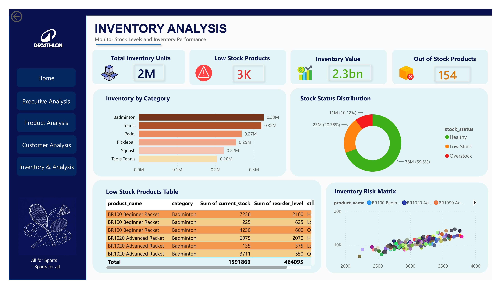
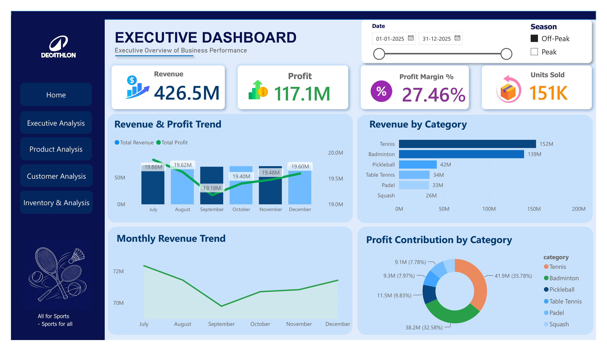
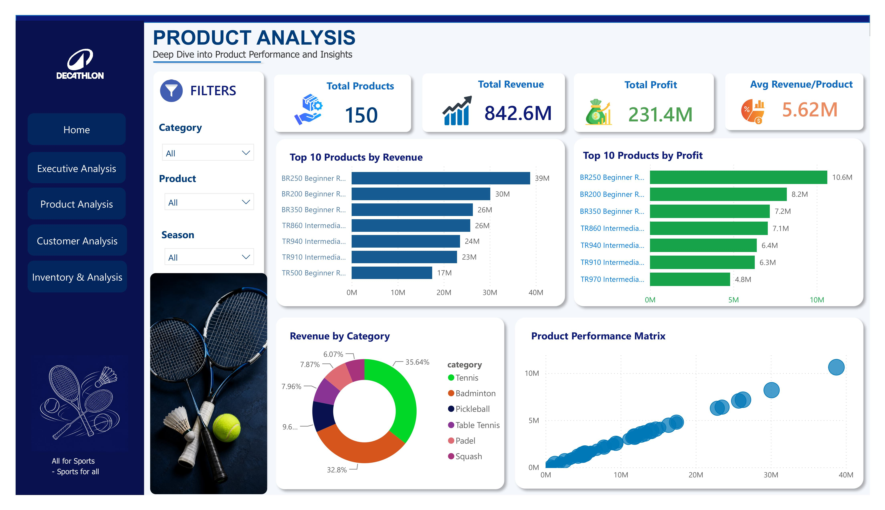

# Decathlon Racket Sports Analytics & Inventory Prediction System

## Project Overview

This project is an end-to-end Retail Analytics and Business Intelligence solution developed to analyze sales performance, inventory health, customer purchasing behavior, and product profitability across Decathlon's Racket Sports category.

The project combines MySQL, SQL, Python, and Power BI to transform raw transactional data into actionable business insights that support retail decision-making and inventory optimization.

---

## Business Objectives

- Analyze sales performance across stores
- Monitor inventory health and stock availability
- Identify top-performing products and categories
- Understand customer purchasing behavior
- Improve inventory planning and replenishment
- Support data-driven retail decision making

---

## Tools & Technologies

- MySQL
- SQL
- Python
- Power BI
- Excel
- VS Code
- GitHub

---

## Dataset Summary

| Dataset | Records |
|----------|----------|
| Products | 150 |
| Customers | 15,000 |
| Sales Transactions | 100,000 |
| Inventory Records | 15,000 |

---

## Sports Categories

- Badminton
- Tennis
- Table Tennis
- Squash
- Pickleball
- Padel

---

## Stores Included

- R City Ghatkopar
- Phoenix Kurla
- Viviana Thane
- Prabhadevi
- Dombivli
- Worli

---

# Database Structure

### Database Name

`decathlon_racket_sports`

### Tables

- stores
- products
- customers
- sales
- inventory

---

# SQL Analysis

The project uses SQL for database management, data preparation, validation, and business analysis.

### Analysis Performed

- Revenue Analysis
- Product Performance Analysis
- Store Performance Analysis
- Customer Analysis
- Inventory Analysis
- Profitability Analysis
- Category Performance Analysis
- Monthly Sales Trends
- Low Stock Identification

### SQL Skills Demonstrated

- Database Creation
- Table Creation
- Data Loading
- Joins
- Aggregate Functions
- GROUP BY
- Subqueries
- Business KPI Analysis

---

# Power BI Dashboard

The solution includes a 5-page interactive dashboard designed for management reporting and business decision-making.

## Page 1: Home Dashboard

- Interactive Navigation Hub
- Decathlon Branding
- Dashboard Navigation Buttons
- Project Overview

## Page 2: Executive Analysis

- Revenue KPIs
- Profit KPIs
- Revenue Trends
- Category Performance
- Executive Summary Metrics

## Page 3: Product Analysis

- Product Performance Analysis
- Revenue Contribution
- Profitability Analysis
- Category Comparison
- Top Performing Products

## Page 4: Customer Analysis

- Customer Segmentation
- Purchase Behaviour Analysis
- Customer Distribution
- Revenue Per Customer

## Page 5: Inventory & Insights

- Inventory Health Monitoring
- Low Stock Identification
- Reorder Analysis
- Business Recommendations

---

# Key Performance Indicators (KPIs)

- Total Revenue
- Total Profit
- Profit Margin %
- Total Quantity Sold
- Average Order Value
- Total Customers
- Total Products
- Total Inventory Units
- Average Revenue Per Customer
- Low Stock Products

---

# Dashboard Screenshots

## 🏠 Home Dashboard



---

## 📊 Executive Analysis



---

## 📦 Product Analysis



---

## 👥 Customer Analysis


---

## 📈 Inventory & Insights


---

# Key Business Insights

- Identified top-performing products and categories across racket sports.
- Evaluated store-wise sales performance and profitability.
- Monitored inventory health and stock availability.
- Detected low-stock products requiring replenishment.
- Analyzed customer purchasing behavior and buying patterns.
- Generated actionable insights for inventory planning and retail decision-making.

---

# Business Impact

This solution helps retail managers:

- Improve inventory planning and replenishment.
- Reduce stock shortages and stock-out risks.
- Track sales and profitability performance.
- Optimize product assortment strategies.
- Improve operational efficiency.
- Make data-driven business decisions.

---

# Future Enhancements

- Inventory Demand Forecasting using Machine Learning
- Automated Reorder Recommendation System
- Sales Prediction Models
- Customer Lifetime Value Analysis
- Advanced Retail Analytics Dashboard
- Real-Time Inventory Monitoring

---

# Repository Structure

```text
Decathlon-Racket-Sports-Analytics
│
├── Dataset
├── SQL
├── Python
├── PowerBI
├── Documentation
├── Screenshots
└── README.md
```

---

# Author

## Bipasha Reddy

**M.Sc. Data Science | Data Analyst | Power BI Developer**

### Skills

SQL • MySQL • Python • Power BI • Excel • Data Visualization • Business Analytics

---

### Connect

- LinkedIn: https://www.linkedin.com/in/bipasha-reddy-0205bredd/
- GitHub: https://github.com/ItsBRedd
